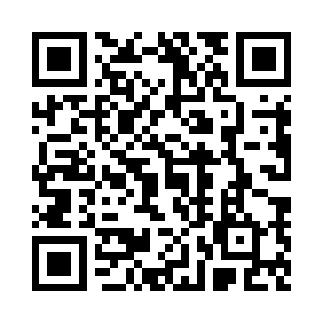

# NNBC Snack Bar

A web app for the NNBC Snack Bar. Customers browse the menu, add items to their cart, and check out via Venmo. Shop owners manage inventory, add/edit/delete items, and upload photos — all from the browser, no code needed.

🌐 **Live site:** [https://NNBCBoosterclub.github.io/](https://NNBCBoosterclub.github.io/)



## 🌐 Live Site & Hosting on GitHub

The site deploys automatically to **GitHub Pages** whenever changes are pushed to the `main` branch.

---

## 🔐 Admin Panel (`admin.html`)

The admin panel is a **separate page** at `/admin.html` (link is in the store header: ⚙️ Admin).

### First-time setup

When you open `admin.html` for the first time you'll be prompted to **create a PIN** (minimum 4 characters). The PIN is hashed with SHA-256 before being stored in the browser — it is never stored in plain text.

### What admins can do

| Action | How |
|---|---|
| **Add a new item** | Fill in the form at the top and click **Add Item** |
| **Upload a product photo** | Use the photo field in the form (max 10 MB — resized automatically) |
| **Edit an item** | Click **✏️ Edit** next to any item |
| **Delete an item** | Click **🗑 Delete** next to any item |
| **Set starting stock** | Enter a number in the "Starting Stock" field, or check **Unlimited** |
| **Restock an item** | Click **+ Restock** next to the item, enter a quantity, press ✓ |
| **Change your PIN** | Use the Settings section at the bottom |
| **Reset menu to defaults** | Use the Danger Zone at the bottom |

> **Tip:** Changes are saved in the browser's **local storage** — they persist across page refreshes on the same device. If you manage the snack bar from a dedicated tablet or laptop, changes will always be there.

---

## 📦 Inventory Tracking

Each item has a **stock count** that you control:

| Stock value | Meaning |
|---|---|
| **Unlimited (∞)** | Not tracked — customers always see the item as available |
| **N > 0** | N units remaining; customers can add up to N to their cart |
| **0** | **Out of Stock** — card is greyed out, customers cannot add to cart |

### How stock changes

- **Admin sets stock** when adding or editing an item.
- **Admin uses "+ Restock"** to add quantity (e.g., after resupplying).
- **Stock decrements automatically** when a customer opens Venmo to pay (i.e., when they confirm their order). Items with `≤ 5` units show a yellow "Only N left!" badge on the customer menu.

> **⚠️ Single-device limitation:** Since this is a static site with no backend, stock data is stored in the browser's localStorage. Each device has its own independent copy. This means:
> - Stock decrements correctly when customers order on the **same device** as the admin panel.
> - If customers order from **their own phones**, their stock decrement only affects their own browser — the admin's device won't see it. For this reason, inventory tracking works best on a **shared counter device** where both the menu and admin views run in the same browser.

---

## 📷 QR Code

A scannable QR code linking to the store is included at the top of this README and can be printed to post at the snack bar.

In the app, click the **📷 QR Code** button in the store header to:
- See a scannable QR code that links directly to the store.
- Print a clean QR code page to post at the snack bar.

---

## ✏️ Updating Venmo Info

The Venmo account details are at the top of `index.html`:

```js
const VENMO_USERNAME = "NNBoosterClub";              // Venmo @handle (no @)
const VENMO_DISPLAY  = "Northern Neck Booster Club"; // Display name shown to users
```

Edit and push to `main` — the site redeploys automatically.
